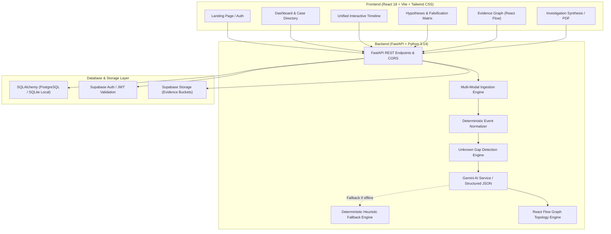
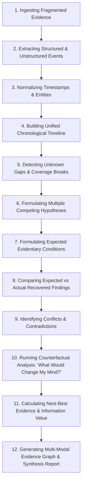

# TRACE-X Architecture & System Design

## 1. Overview

**TRACE-X** is an AI-powered hidden event reconstruction and evidence-seeking platform designed to analyze fragmented multi-modal evidence (CCTV footage, GPS telemetry, access control badge logs, and microphonic/vibration sensors).

The system enforces strict epistemological rigor:
- **Never fabricates facts**: Unmonitored intervals are explicitly recognized as **Unknown Gaps**.
- **Categorizes evidentiary status**: `OBSERVED`, `INFERRED`, `UNKNOWN`, `MISSING`, `CONTRADICTED`, `SUPPORTED`, `PARTIALLY_SUPPORTED`.
- **Heuristic Labeling**: Probabilistic reasoning is explicitly presented as a **Heuristic Reasoning Score** (0–100) or **Heuristic Information Value** (0.0–1.0) rather than claiming calibrated mathematical certainty or legal certification.

---

## 2. High-Level Architecture Diagram

---

## 3. The 12-Step Reconstruction Pipeline

---

## 4. Multi-Modal Evidence Normalization

| Raw Source Type | Extracted Event Format | Status | Confidence |
| :--- | :--- | :--- | :--- |
| **CCTV PTZ Camera** | Frame timestamp, bounding box, object trajectory, apparel cues | `OBSERVED` | 0.90 – 0.99 |
| **Fleet CAN-Bus** | Timestamped door-pin switch, accelerometer impulse | `OBSERVED` | 0.95 – 1.00 |
| **RFID Badge Reader** | Card UID, Facility Code, Grant/Deny Status | `OBSERVED` | 1.00 |
| **PIR / Motion Fence** | Localized vibration signal, duration | `OBSERVED` | 0.85 – 0.95 |
| **Unmonitored Window** | Disappearance time to Reappearance time | `UNKNOWN GAP` | Explicit Zero-Inference |

---

## 5. Security & Sensitive Key Protection

- **Server-Side AI Secrets**: The `GEMINI_API_KEY` is loaded strictly via environment variables in the Python FastAPI backend. No Gemini keys or database administrative keys are ever bundled or exposed in client JavaScript.
- **Supabase Authentication**: Client tokens are validated against Supabase Auth, while sensitive row modifications are governed by Row Level Security (RLS) policies in PostgreSQL.
- **Legal Advisory**: Generated reports automatically embed the required legal disclaimer specifying that TRACE-X is an analytical assistance system and not an accredited forensic or legal certification authority.
